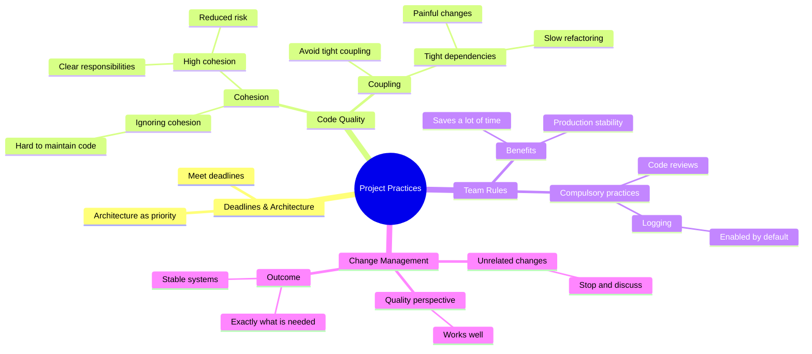

# test

```mermaid
mindmap
  root((Project Practices))
    Deadlines & Architecture
      Meet deadlines
      Architecture as priority
    Code Quality
      Cohesion
        Ignoring cohesion
          Hard to maintain code
        High cohesion
          Clear responsibilities
          Reduced risk
      Coupling
        Avoid tight coupling
        Tight dependencies
          Slow refactoring
          Painful changes
    Team Rules
      Compulsory practices
        Code reviews
        Logging
          Enabled by default
      Benefits
        Saves a lot of time
        Production stability
    Change Management
      Unrelated changes
        Stop and discuss
      Quality perspective
        Works well
      Outcome
        Stable systems
        Exactly what is needed
```